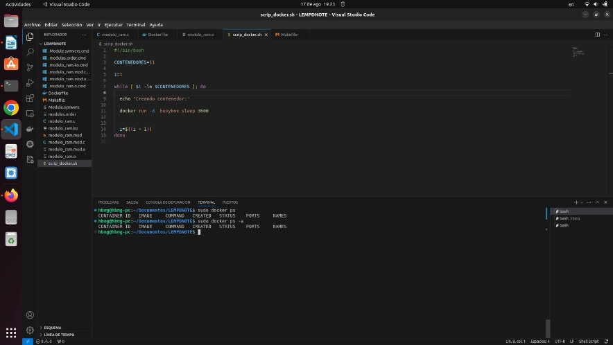
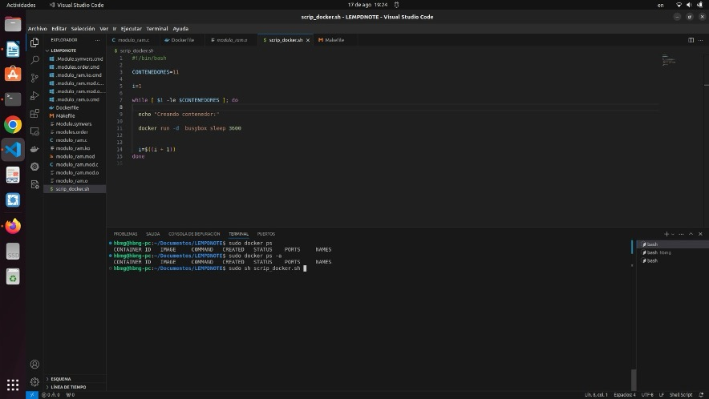
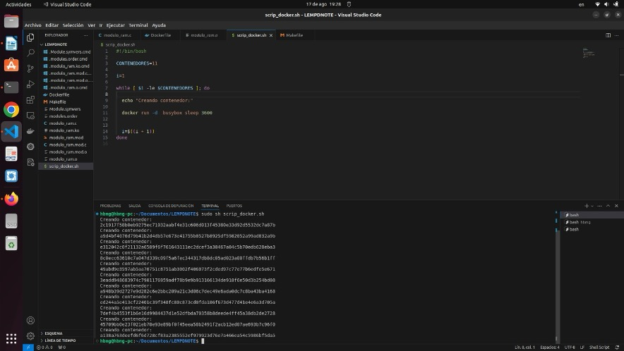

1. Visualizacion de los contenedores corriendo en docker

|bash|
|----|
```bash
docker ps -a

docker ps
```



2. Ejecucion del script

|bash|
|----|
```bash
sudo sh scrip_docker.sh
```


3. Visualizacion de la creacion



4. Visualizacion de los contenedores corriendo


